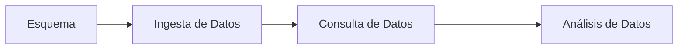
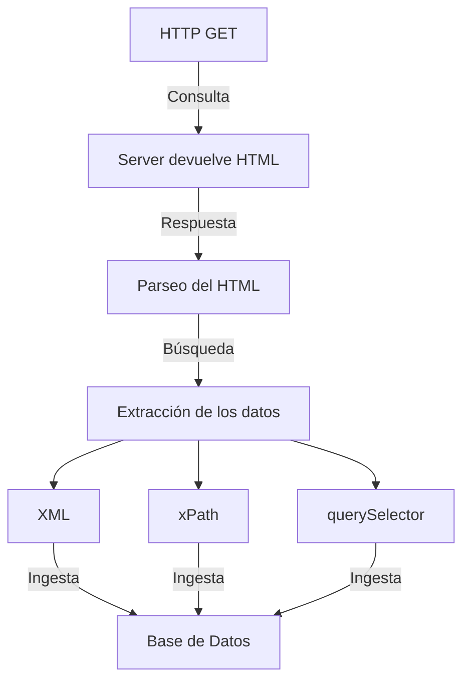
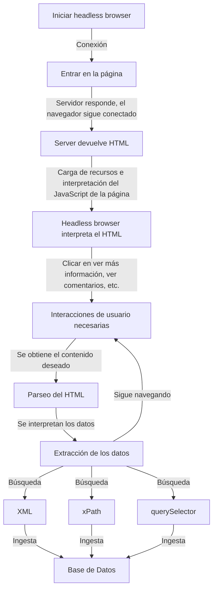

# Web Scraping y las Bases de Datos Ofuscadas

Catedra de Universidad de Valencia con Capgemini

Taller: [https://github.com/jofaval/girls4stem-web-scraping](https://github.com/jofaval/girls4stem-web-scraping)

## Bases de Datos

### Diagrama de Flujo

## Web Scraping

### Básico

clarifying
simplifying

### Headless

